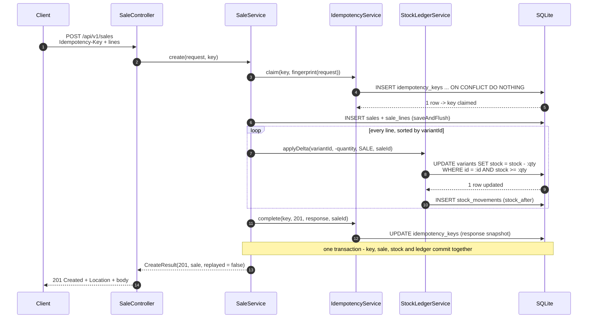
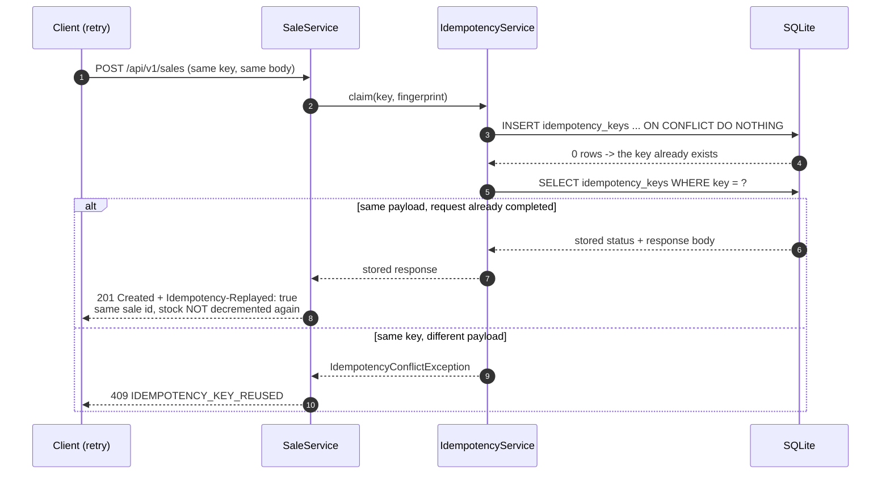
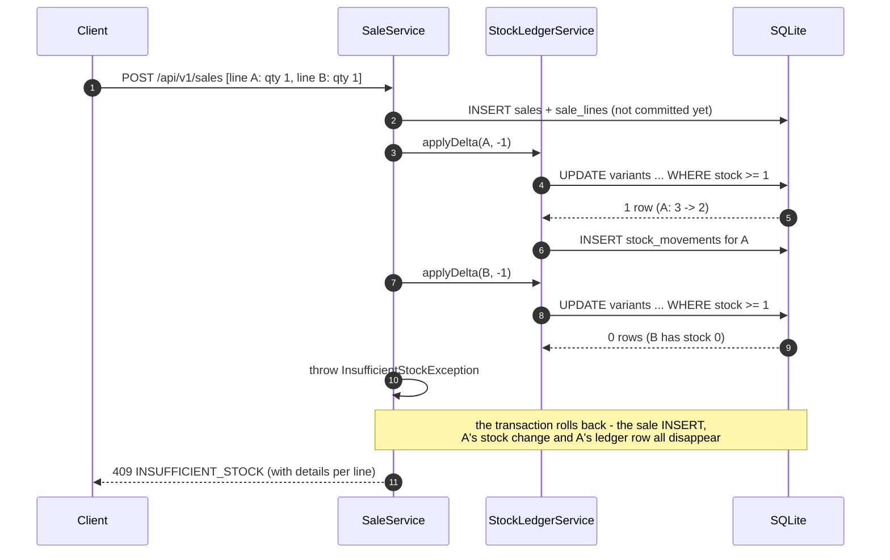
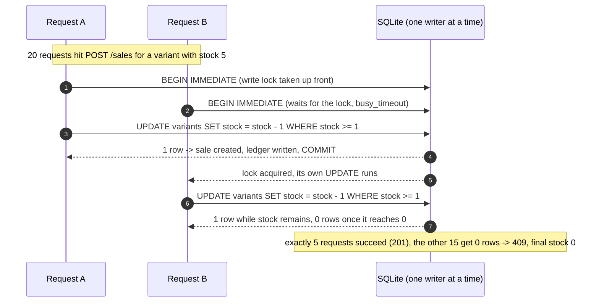
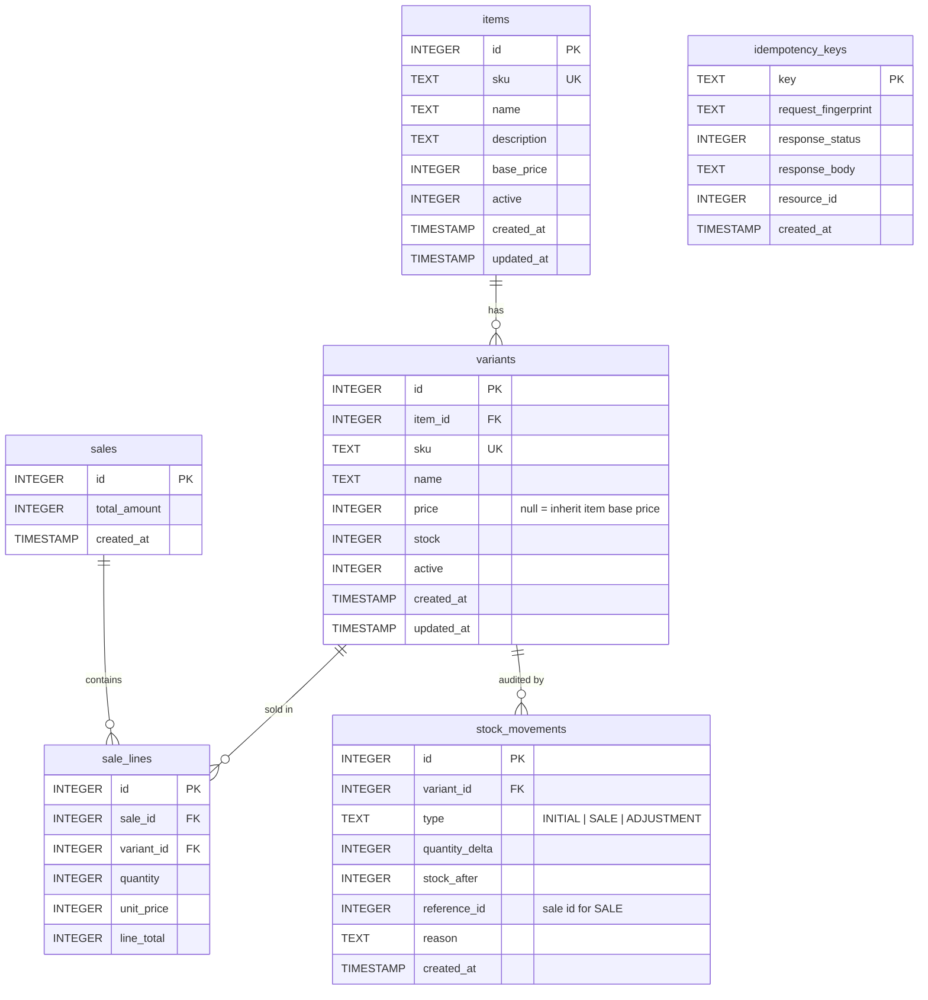

# Warehouse API

REST API for managing a small shop's warehouse: items, variants, prices, and stock.

Built with **Java 21**, **Spring Boot 3.5**, **Spring Data JPA**, and **SQLite**.

The API never sells more than it has: stock changes go through a single atomic
`UPDATE ... WHERE stock >= quantity` and every change is written to a stock
ledger in the same transaction. See [Design decisions](#design-decisions).

---

## Table of contents

- [Overview](#overview)
- [Requirements](#requirements)
- [How to run](#how-to-run)
- [API reference](#api-reference)
- [Key flows](#key-flows)
- [Data model](#data-model)
- [Design decisions](#design-decisions)
- [Assumptions](#assumptions)
- [Testing](#testing)
- [What I would add with more time](#what-i-would-add-with-more-time)
- [AI usage disclosure](#ai-usage-disclosure)
- [Project layout](#project-layout)

## Overview

- **Items** are what the shop sells (e.g. "Basic Cotton T-Shirt").
- **Variants** are the actual stock-keeping units (e.g. "M / Black", "Size 41").
  An item can have any number of variants; a variant belongs to exactly one item.
- **Prices** are stored on both levels: the item has a base price, a variant may
  override it (`price = null` means "use the item's base price").
- **Stock** is tracked per variant. Item-level stock is always the sum of its
  variants, computed on read (nothing is denormalised, so it cannot drift).
- **Sales** decrement stock atomically, snapshot the unit price, and record a
  ledger entry per line. A sale is all-or-nothing: if one line cannot be
  fulfilled, the whole sale is rolled back.
- **Deletion is soft** (`active = false`) for items and variants, so sales
  history stays intact and referential integrity is never broken.

## Requirements

- JDK 17 or newer (developed and tested on **JDK 21**)
- No local Maven installation needed - the Maven wrapper (`./mvnw`) is included

## How to run

From the project root:

```bash
./mvnw spring-boot:run
```

The application starts on <http://localhost:8080> and, on first start:

- creates the SQLite database file `warehouse.db` in the project root,
- applies `sql/01-schema.sql` (schema) and `sql/02-seed.sql` (sample data).

Both scripts are idempotent, so restarting never duplicates or resets data.

If `JAVA_HOME` is not set, point it at a JDK 17+ first, for example:

```bash
export JAVA_HOME=/opt/homebrew/opt/openjdk@21/libexec/openjdk.jdk/Contents/Home
```

A `Makefile` is included which selects the right JDK automatically:

```bash
make run     # start the application
make test    # run the test suite
make build   # package the jar (target/warehouse-api-0.0.1-SNAPSHOT.jar)
```

The seed data contains four items, seven variants (including one variant with
stock 0 and one item without variants), and their `INITIAL` ledger entries.

## API reference

Base URL: `/api/v1`. All request and response bodies are JSON.

Every error uses the same envelope:

```json
{
  "error": {
    "code": "INSUFFICIENT_STOCK",
    "message": "Insufficient stock for 1 line",
    "details": [
      { "field": "variant SNEAKER-RUN-42", "issue": "requested 1 but only 0 available" }
    ],
    "timestamp": "2026-10-04T02:15:31.482Z",
    "path": "/api/v1/sales"
  }
}
```

Error codes: `VALIDATION_ERROR` (400), `INVALID_REQUEST` (400), `NOT_FOUND` (404),
`CONFLICT` (409), `INSUFFICIENT_STOCK` (409), `IDEMPOTENCY_KEY_REUSED` (409),
`INTERNAL_ERROR` (500).

| Method | Path | Description |
| --- | --- | --- |
| `POST` | `/items` | Create an item |
| `GET` | `/items` | List items (`q`, `active`, `page`, `size`) |
| `GET` | `/items/{id}` | Item detail with `variantCount` and `totalStock` |
| `PUT` | `/items/{id}` | Update name, description, base price |
| `DELETE` | `/items/{id}` | Soft delete (deactivate) an item |
| `POST` | `/items/{itemId}/variants` | Create a variant for an item |
| `GET` | `/items/{itemId}/variants` | List a item's active variants |
| `GET` | `/variants/{id}` | Variant detail (includes `effectivePrice`) |
| `PUT` | `/variants/{id}` | Update name and price override |
| `DELETE` | `/variants/{id}` | Soft delete (deactivate) a variant |
| `POST` | `/variants/{id}/stock-adjustments` | Restock or correct stock |
| `GET` | `/variants/{id}/stock-movements` | Stock ledger for a variant |
| `POST` | `/sales` | Create a sale (supports `Idempotency-Key`) |
| `GET` | `/sales` | List sales, newest first |
| `GET` | `/sales/{id}` | Sale detail with its lines |

### Examples

List items (paginated, newest filter by name or SKU with `q`):

```bash
curl "http://localhost:8080/api/v1/items?size=5"
curl "http://localhost:8080/api/v1/items?q=shoe"
```

Create an item:

```bash
curl -i -X POST http://localhost:8080/api/v1/items \
  -H 'Content-Type: application/json' \
  -d '{"sku":"HOODIE-BASIC","name":"Basic Hoodie","description":"Fleece hoodie","basePrice":150000}'
```

Add a variant to it (item id from the `Location` header above):

```bash
curl -i -X POST http://localhost:8080/api/v1/items/5/variants \
  -H 'Content-Type: application/json' \
  -d '{"sku":"HOODIE-BASIC-M","name":"M / Grey","initialStock":10}'
```

Restock or correct stock (positive = in, negative = out):

```bash
curl -X POST http://localhost:8080/api/v1/variants/8/stock-adjustments \
  -H 'Content-Type: application/json' \
  -d '{"quantityDelta":5,"reason":"Restock from supplier"}'
```

Sell two different variants in one sale:

```bash
curl -i -X POST http://localhost:8080/api/v1/sales \
  -H 'Content-Type: application/json' \
  -H 'Idempotency-Key: 5f0c1c1e-8f4a-4d2e-9a1b-1c2d3e4f5a6b' \
  -d '{"lines":[{"variantId":1,"quantity":2},{"variantId":6,"quantity":1}]}'
```

Repeat the exact same request (same `Idempotency-Key` and body) to see the replay:

```bash
curl -i -X POST http://localhost:8080/api/v1/sales \
  -H 'Content-Type: application/json' \
  -H 'Idempotency-Key: 5f0c1c1e-8f4a-4d2e-9a1b-1c2d3e4f5a6b' \
  -d '{"lines":[{"variantId":1,"quantity":2},{"variantId":6,"quantity":1}]}'
# HTTP/1.1 201 Created
# Idempotency-Replayed: true
# ... the original sale, stock is NOT decremented a second time
```

Try to oversell (seeded variant `SNEAKER-RUN-42` has stock 0):

```bash
curl -X POST http://localhost:8080/api/v1/sales \
  -H 'Content-Type: application/json' \
  -d '{"lines":[{"variantId":5,"quantity":1}]}'
# 409 with error.code = INSUFFICIENT_STOCK
```

Inspect the stock ledger of a variant:

```bash
curl "http://localhost:8080/api/v1/variants/1/stock-movements"
```

Soft delete an item (it disappears from the default listing, history stays):

```bash
curl -i -X DELETE http://localhost:8080/api/v1/items/4
curl "http://localhost:8080/api/v1/items?active=false"
```

## Key flows

### Creating a sale (happy path, with `Idempotency-Key`)



### Duplicate request: replay or conflict



### Insufficient stock: the whole sale rolls back



### Concurrent sales never oversell



## Data model



Notes:

- `stock_movements` is append-only; corrections are new rows, never edits.
- `sale_lines.unit_price` is a snapshot, so later price changes never rewrite
  history.
- `idempotency_keys` is an internal table; it is never exposed through the API.

## Design decisions

### 1. Layered architecture in a single Maven module

`controller -> service -> repository -> model`, plus `dto` and `exception`.
A single module (instead of a multi-module build or Spring Modulith) keeps the
project easy to run and review; the layering already gives the important
benefit - HTTP concerns stay in controllers, business rules in services, and
persistence in repositories.

### 2. DTOs at the API boundary, entities never exposed

Entities carry lazy relations and database-shaped fields; serialising them would
couple the API contract to the schema and risk lazy-loading errors
(`open-in-view` is disabled). Requests and responses are Java records with Bean
Validation annotations, mapped explicitly in the service layer.

### 3. No Lombok

Getters, constructors, and factories are written out. It keeps the code
transparent (important for a reviewer) and avoids annotation-processor magic.

### 4. Oversell protection: one atomic conditional UPDATE

All stock changes go through `StockLedgerService`, which calls a single query:

```sql
UPDATE variants SET stock = stock + :delta, updated_at = :now
 WHERE id = :id AND stock + :delta >= 0
```

The database evaluates the guard while holding the row's write lock, so
check-and-set is one atomic operation; the returned row count tells us whether
the change was accepted (0 = rejected). A read-then-write implementation would
have a race window (two cashiers both read 5, both write 4) - that is exactly
what this avoids. The `CHECK (stock >= 0)` constraint in the schema is the
second line of defence.

Optimistic locking (`@Version`) was considered and rejected: it detects
conflicts but forces the caller to retry, whereas the conditional update simply
serialises correct outcomes and lets the API answer with a precise
`INSUFFICIENT_STOCK` error.

### 5. Sales are one transaction

`SaleService.create` inserts the sale and its lines, decrements stock for every
line, and writes the ledger rows inside a single transaction. If any line fails,
everything rolls back - verified by a test that asserts the first line's stock is
unchanged after a failed multi-line sale.

### 6. Stock ledger (audit trail)

Every stock change writes one `stock_movements` row in the same transaction, so
stock and its history can never disagree. `GET /variants/{id}/stock-movements`
exposes it. The ledger makes the stock number explainable, which matters more
than the number itself once a shop has returns, corrections, or shrinkage.

### 7. Idempotent sales (`Idempotency-Key`)

`POST /sales` accepts an optional `Idempotency-Key` header:

1. The key is claimed with `INSERT ... ON CONFLICT(key) DO NOTHING` **inside the
   business transaction** - so the key and the sale commit or roll back together.
   A failed request leaves no key behind, and retrying it works normally.
2. `ON CONFLICT DO NOTHING` is deliberate: a unique-constraint violation would
   poison the JPA transaction, and we could no longer read the stored response
   to replay it.
3. The stored response is replayed for a duplicate request with the same payload
   (`Idempotency-Replayed: true`, same status and body, stock untouched).
4. The same key with a **different** payload is rejected with `409`
   (`IDEMPOTENCY_KEY_REUSED`), detected via a SHA-256 fingerprint of the request.
5. Concurrent duplicates are serialised by SQLite's single writer; the second
   request waits, then sees the committed key and replays.

Trade-off: keys are never deleted (no TTL cleanup) and the payload fingerprint
is stored rather than the full request. Both are noted under
[future work](#what-i-would-add-with-more-time).

### 8. Soft delete everywhere

`DELETE` sets `active = false`; sales of inactive items/variants are rejected
with `409`. Hard deletes would either break foreign keys from `sale_lines` or
silently rewrite history, so they are not offered.

### 9. SQLite: the right trade-off for this size, with the sharp edges handled

SQLite gives a zero-setup, file-based database that the reviewer can run
immediately. Its constraint - a single writer at a time - is handled explicitly:

- `journal_mode=WAL` lets readers continue while a writer is active,
- `busy_timeout=10000` makes writers wait for a lock instead of failing,
- `transaction_mode=IMMEDIATE` starts every transaction with `BEGIN IMMEDIATE`.

The last one was found by the concurrency test: without it, a transaction that
reads first (loading variants) and writes later (inserting the sale) fails
immediately with `SQLITE_BUSY`, because SQLite does **not** invoke the busy
handler when a transaction upgrades from a read lock to a write lock. With
`BEGIN IMMEDIATE` the write lock is taken up front and writers queue properly.
The cost is that read-only transactions also take the write lock; for a
single-file, single-instance app that is an acceptable trade.

### 10. Money as integer minor units

Prices are integers (`75000` = Rp 75.000). Floating point is never used for
money, and the IDR minor unit is the rupiah, so plain integers are exact. The
API documents the unit; a multi-currency version would store a currency code and
an exponent per amount.

### 11. Timestamps

Entities use `Instant` (UTC) and Jackson serialises ISO-8601
(`2026-10-04T02:15:31.482Z`). SQLite stores epoch milliseconds, so timestamps are
truncated to milliseconds at the source - otherwise a freshly created resource
would report more precision than a later read returns.

### 12. Error handling in one place

Typed exceptions (`NotFoundException`, `ConflictException`,
`InsufficientStockException`, ...) extend a common `ApiException` carrying an
HTTP status, an error code, and optional details. A single
`@RestControllerAdvice` turns them into the envelope above. Bean Validation
failures, malformed JSON, and bad path variables are mapped to `400` with
per-field details. `DataIntegrityViolationException` is mapped to `409` as the
last line of defence: the `existsBySku` check gives a friendly message, but only
the database constraint can actually prevent duplicates under concurrency.

### 13. Pagination envelope

Responses use a small `PageResponse<T>` record instead of serialising Spring's
`Page` directly, keeping the JSON contract stable and independent of framework
changes.

### 14. Testing strategy

Integration tests drive real HTTP endpoints through `MockMvc` against a real
SQLite file; each test class gets its own throwaway database
(`@DynamicPropertySource`) so tests are order-independent. Item tests are
`@Transactional` (rolled back); sale tests commit for real, because a rollback is
only observable outside the transaction that performed the work. The concurrency
test starts a real server and fires 20 simultaneous sales for a variant with 5
units, asserting exactly 5 succeed, 15 are rejected, the final stock is 0, and
the ledger holds exactly 5 `SALE` rows.

## Assumptions

- Single warehouse / stock location; no per-location stock.
- No authentication or authorisation - the assessment is about inventory
  behaviour, and adding a half-secured auth layer would be worse than none.
- Single currency (IDR), integer minor units.
- Variant attributes (size, colour) are carried in the variant name and SKU;
  there is no structured attribute model.
- An item with no variants cannot be sold; it has no stock.
- SKUs are immutable after creation and unique across all items/variants.
- Sales are immediate: no carts, reservations, or partial fulfilment, and no
  tax, discount, or shipping.
- Prices may change over time; sale lines snapshot the price at sale time.
- `Idempotency-Key` is optional. Clients that care about retry safety should
  send it.
- Concurrent access assumes a single application instance using the SQLite file.

## Testing

```bash
./mvnw test    # or: make test
```

17 tests:

- `ItemApiIntegrationTest` (8) - create/read/update/soft delete, pagination and
  search, duplicate SKU, validation details, 404s.
- `SaleApiIntegrationTest` (8) - successful multi-line sale with stock and
  ledger assertions, insufficient stock, full rollback of a partially
  fulfillable sale, duplicate variant lines, unknown variant, inactive item,
  idempotent replay, idempotency key reuse.
- `SaleConcurrencyTest` (1) - 20 simultaneous sales for 5 units of stock; proves
  no oversell under contention.

## What I would add with more time

- TTL cleanup for `idempotency_keys` (a scheduled delete of old rows) and a
  dedicated `Idempotency-Key` for other unsafe endpoints via the same service.
- Authentication/authorisation (API keys or JWT) and per-client rate limiting.
- Multi-warehouse stock with per-location balances, plus reservations for
  pending orders.
- Returns/refunds as negative sales, reusing the ledger.
- OpenAPI documentation (springdoc) and a Dockerfile + CI pipeline running
  `./mvnw test`.
- A PostgreSQL profile (dialect + Flyway migrations) for multi-instance
  deployments, where the single-writer constraint disappears.

## AI usage disclosure

I used an AI coding assistant during this assessment. It proposed the project
setup, the SQL scripts, the DTOs, and the first draft of this README; I typed,
reviewed, and adjusted the implementation, and every design decision documented
above is one I can explain and defend. Where a proposal did not survive testing -
the SQLite lock upgrade failing under concurrent sales - the fix and its
rationale are documented in the design decisions above rather than hidden.

## Project layout

```
.
├── pom.xml                     Maven build (Spring Boot parent, Java 21)
├── mvnw / mvnw.cmd             Maven wrapper
├── Makefile                    convenience targets (JDK selection, run, test)
├── sql/
│   ├── 01-schema.sql           schema, applied on every start (idempotent)
│   └── 02-seed.sql             sample data + initial ledger entries
├── src/main/java/com/geli/warehouse/
│   ├── WarehouseApplication.java
│   ├── controller/             REST endpoints
│   ├── service/                business rules, transactions, stock ledger
│   ├── repository/             Spring Data repositories
│   ├── model/                  JPA entities
│   ├── dto/                    request/response records
│   ├── exception/              typed exceptions + global error handler
│   └── util/                   timestamp helper
├── src/main/resources/application.yml
├── src/test/java/com/geli/warehouse/
│   ├── ItemApiIntegrationTest.java
│   ├── SaleApiIntegrationTest.java
│   └── SaleConcurrencyTest.java
└── warehouse.db                created at runtime (git-ignored)
```
